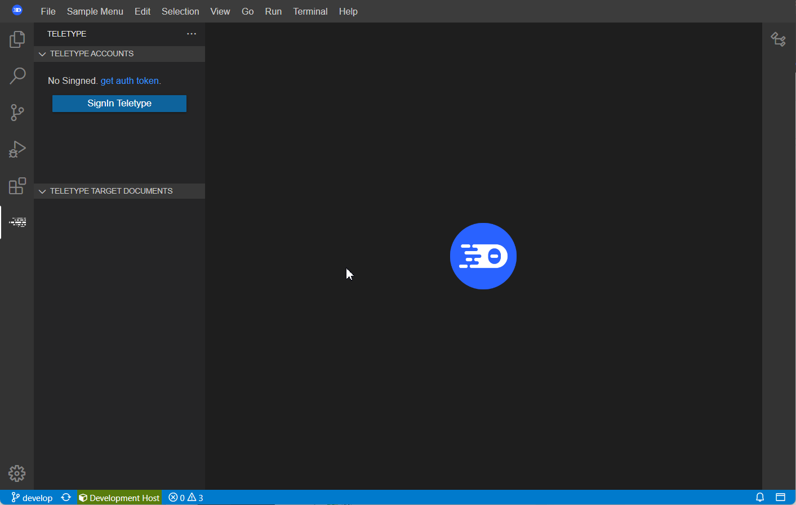

# vscode-teletype

**Teletype for VisualStudio Code and Theia and Code-Server**

---

<p align="center">
   <p align="center">
     <a href="README.md">English</a>
     ·
     <a href="README_kr.md">Korean</a>
   </p>
</p>

---

## Running Teletype in Eclipse Che

To use Teletype in Eclipse Che, add a plug-in to Devfile.  
The plug-in format is as follows.

```yaml
apiVersion: v2
publisher: Amos
name: teletype
category: Language
type: VS Code extension
description: Teletype for Visual Studio Code
displayName: Teletype
firstPublicationDate: "2023-01-01"
icon: https://github.com/amos42/vscode-teletype/blob/master/resources/teletype.svg
repository: https://github.com/amos42/vscode-teletype
version: 0.0.1
spec:
  extensions:
  - 'https://my-plugin-server/repository/vscode-teletype-0.0.1.vsix'
```

When the Devfile input box for creating a workspace appears by clicking Add Workspace, enter the following information.

```yaml
apiVersion: 1.0.0
metadata:
   name: Teletype_test_1
   projects:
     - name: sample_001
       source:
         location: 'https://my-project-server/samples/sample_001.git'
         type: github
components:
   - reference: 'https://my-plugin-server/teletype/latest/plugin.yaml'
     type: chePlugin
```

And when you click the Create & Open button, Teletype is installed and operated in the created IDE.
If Teletype is normally installed, the Teletype icon is displayed on the page tab of the IDE.

Clicking on the Teletype tab will take you to the Teletype page.



The elements of each view are as follows.


> **1 - Teletype page tab**
> Switch to Teletype page
>
> **2 - Teletype Accounts**
> Teletype access information and account information
>
> **3 - Teletype Target Documents**
> Editor list currently being shared


## Teletype sign-in

To use Teletype, you must first connect to the server and complete authentication.

Click the Signin button in the Teletype Accounts view at the top.
Then, an input box for entering the authentication token appears.


