# vscode-teletype

**Teletype for VisualStudio Code and Theia and Code-Server**

---

<p align="center">
   <p align="center">
     <a href="README.md">English</a>
     ·
     <a href="README_kr.md">Korean</a>
   </p>
</p>

---

## Running Teletype in Eclipse Che

To use Teletype in Eclipse Che, add a plug-in to Devfile.
When the Devfile input box for creating a workspace appears by clicking Add Workspace, enter the following information.

```yaml
apiVersion: 1.0.0
metadata:
   name: Teletype-test-1
   projects:
     - name: testcase-spring1
       source:
         location: 'https://github.com/samples/testcase-spring1.git'
         type: github
components:
   - reference: 'https://plugin-server/teletype/latest/plugin.yaml'
     type: chePlugin
```

And when you click the Create & Open button, Teletype is installed and operated in the created IDE.
If Teletype is normally installed, the Teletype icon is displayed on the page tab of the IDE.

Clicking on the Teletype tab will take you to the Teletype page.


The elements of each view are as follows.

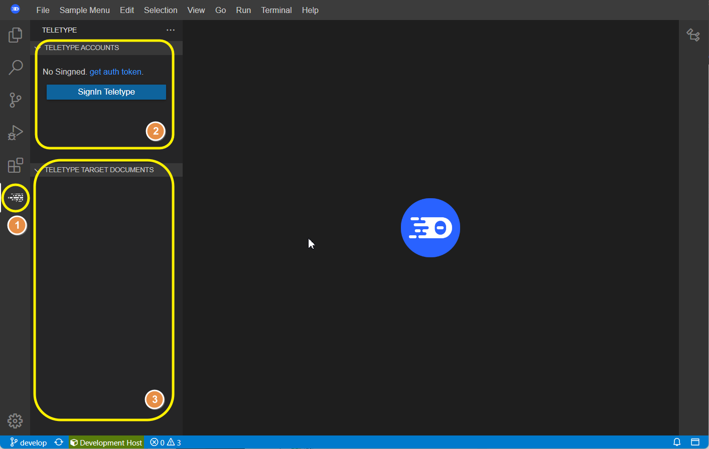

> **1 - Teletype page tab**
> Switch to Teletype page
>
> **2 - Teletype Accounts**
> Teletype access information and account information
>
> **3 - Teletype Target Documents**
> Editor list currently being shared


## Teletype sign-in

To use Teletype, you must first connect to the server and complete authentication.

Click the Signin button in the Teletype Accounts view at the top.
Then, an input box for entering the authentication token appears.


Enter the authentication token and press enter.
When the connection is successful, the Signin button disappears from the Teletype Accounts view and the name of the connected user is displayed.


## Teletype Signout

If you no longer want to use Teletype, simply disconnect from the server.

Right-click the user name item in the Teletype Accounts view to invoke the pop-up menu.


From the pop-up menu, click Signout Teletype.
Then, the account item disappears from the tree of the Teletype Accounts view and the Signin button appears again.


## Share source (Host)

If you want to share the source on your current workspace, you must first create a shared portal as a host and open the portal. Then, other users can connect to the portal and participate as a guest to share the source provided by the host.

To create a shared portal, right-click on the user name item in the Teletype Accounts view to invoke the pop-up menu.


Select Shared Portal from the pop-up menu to create a portal. When the portal is created successfully, a pop-up message is added to the Host item in the Teletype Accounts view.


The current user name is added at the bottom of the Host item by default.
Also, the connection URL of the created portal is put into the clipboard, and you can pass it to users who want to share it in an appropriate way. (ex. Messenger, e-Mail, etc...)


## Copy the shared Portal URL to the clipboard

If there is a need to send a shared portal access URL to a new user during work, the URL can be obtained through the clipboard.

First, right-click the Host item in the Teletype Accounts view to invoke the pop-up menu.


If you click the Copy Portal url to clipboard item in the pop-up menu, a pop-up message is displayed and the URL to access the portal is copied to the clipboard.


> ***Info:*** This operation is available only to the Portal Host user.


## Connect to the shared portal as a guest

In order to participate as a guest in the shared portal that has already been created and browse the sources provided by the host user, other users must know the access URL of the portal in advance. The host user should deliver this access URL to other users in a random way (eg, messenger, e-mail, etc...).
If you know the URL of the shared Portal, connect to the Portal after connecting to Teletype.

In the Teletype Accounts view, right-click the signed-in user name to call the pop-up menu.


If you select Join to Portal from the pop-up menu, the Portal URL input window appears.
Enter the Portal URL in the input window and press enter.


If you have successfully connected to the portal, the Portal Id item appears in the Teletype Accounts view, and the name of the host user and the current signed-in user name appear under it.


> ***info:*** If there is a file being edited by the host user, the source of the file is opened as an editor.


## Synchronize editor changes for following targets

Teletype's basic usage pattern is for different users to view the same source simultaneously. Therefore, when one user changes the source to be edited to another file, other users must be able to immediately browse the corresponding source as well.
At this time, the user pointing to the target of the source is called a **leader**, and the user browsing this source is called a **follower**.
Basically, the host that discloses the source initially becomes the leader by default, and all other guests follow this leader.
However, there may be cases where it becomes unnecessary to continue following changes in the target source of this leader if necessary. In this case, you can stop following. Users can explicitly unfollow, but Teletype can intelligently unfollow depending on editor manipulation situations.
In addition, in a state where multiple users continue to access the Portal at the same time, they can choose a specific user they want to pay attention to and become a follower.

> ***info:*** Host users can basically only be leaders, not followers.

In the state of connecting to the initial portal, * characters are displayed next to the host user's name in the Teletype Accounts view. This indicates that the current following target is the host user.


In this state, when the host user opens a file to be edited or changes the target file being edited, the editor corresponding to the file is opened immediately.

If you want to unfollow, right-click on the Host username in the Teletype Accounts view to invoke the pop-up menu.


If you click Unfollow Portal in the pop-up menu, the * mark next to the host username disappears along with a pop-up message saying Unfollowed.

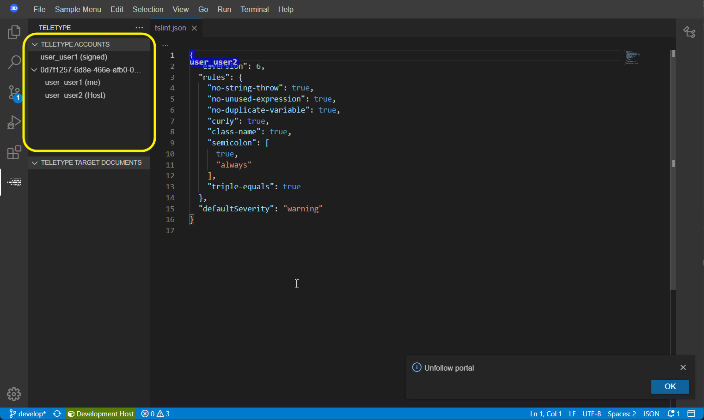

In this state, even if the host user opens a new file or changes the editor being edited, the corresponding editor does not immediately open on the guest user's screen.

If you want to follow a specific user's shared file editing status again, you can designate that user as a leader. When not only the host user but also multiple users connect, any user can be designated as the leader.

In the Teletype Accounts view, right-click the ID of the user you want to follow to invoke the pop-up menu.

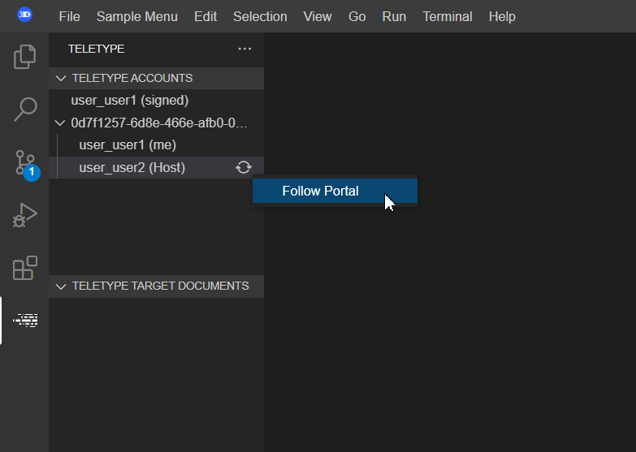

When you click on the Follow Portal, a message saying that you are following is displayed, and * characters appear on the right side of the user. Also, if there is a source currently being edited by the corresponding editor, the corresponding file is also displayed immediately.

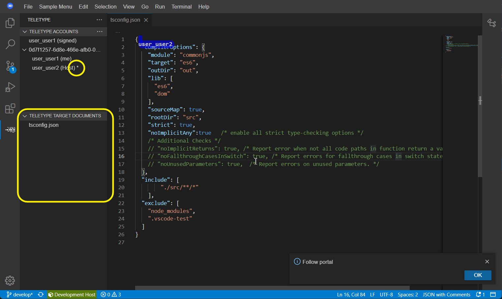


## Open editor in host mode

Basically, source files shared through Portal are limited to text files on the workspace provided by the host user. That is, only host users can provide sources, and guest users' sources cannot be shared.
Therefore, users who want to share sources must first become the host and open the portal, and then open the files on their workspace themselves.

Basically, the Teletype Target Documents view shows a list of active documents among the files in the current workspace.

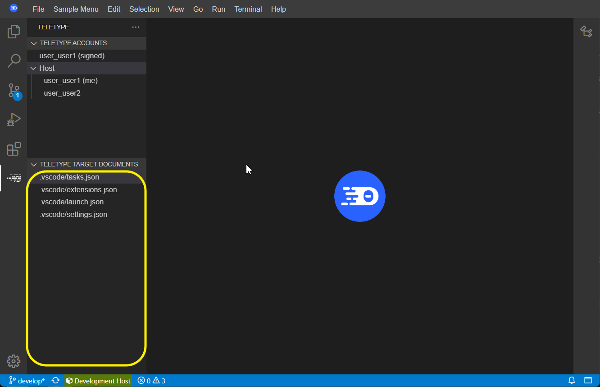

> ***info:*** Files that do not appear in the editor area but are activated internally in the IDE also appear in the list.

If you started sharing your source in Host mode, you should now go to the IDE's Explore tab and navigate to the list of files in your workspace.

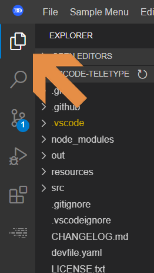

Click any file existing on the workspace to open it.

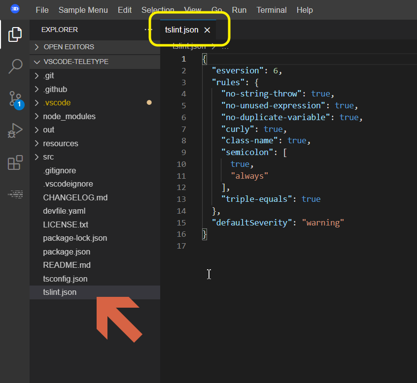

Now, if you move to the Teletype page tab again, the newly opened file is added to the Teletype Target Documents list in the Teletype tab.
In addition, the guest user is also immediately shown the list of files shared by the host user, and if they are in the following state, the file is immediately opened as an editor.

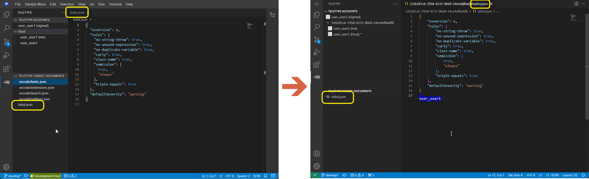


## Change the editor's cursor position

The cursor position in a document shared between a host user and a guest user, or between a guest user and another guest user, can be shared by everyone.

Click the mouse to a specific location in the document. The position of the cursor is moved to the corresponding position.

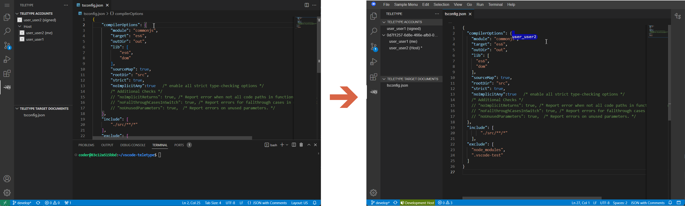

The editor corresponding to the document opened in Host mode is displayed in the editor area.
There is a mark at the cursor position in the host mode editor, and the host mode user ID is indicated.

The new cursor position moved in the host mode editor is marked, and the host mode user ID is indicated.

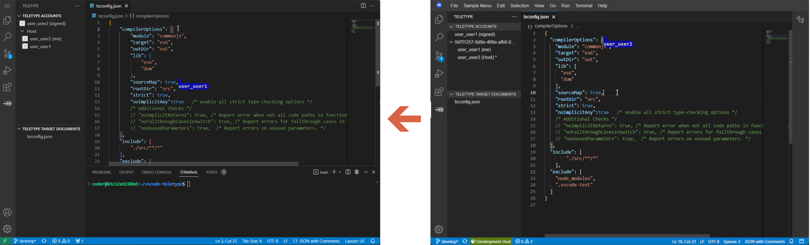

Select an open editor in the workspace containing Teletype in host mode and select a part of the text area as a block by dragging it with the mouse.

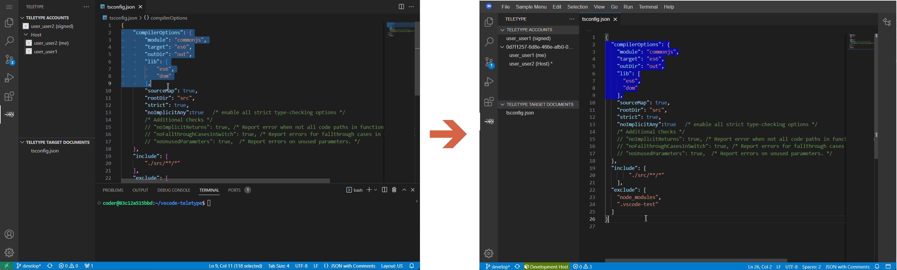

Then, in the guest user's editor, the marker is painted in the same area as the corresponding area.

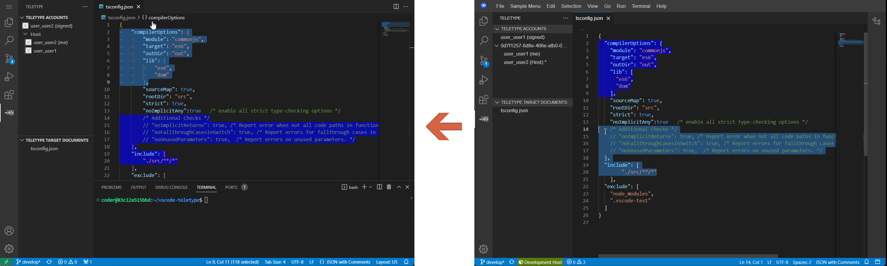


## Synchronize edits

When one user edits a document that is being shared, the edits are immediately displayed in the editors of other users.

Move the cursor to an arbitrary position in the editor and input arbitrary text contents. Then, the same string is displayed in the same location in the editor of other users.

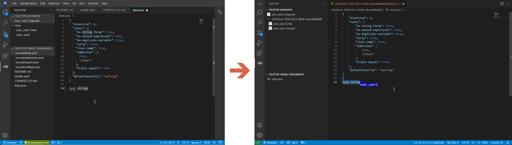

Synchronization of edits is not unidirectional. Even if each user edits each other's editor at the same time, the edited content is immediately reflected in each other's editor in both directions.

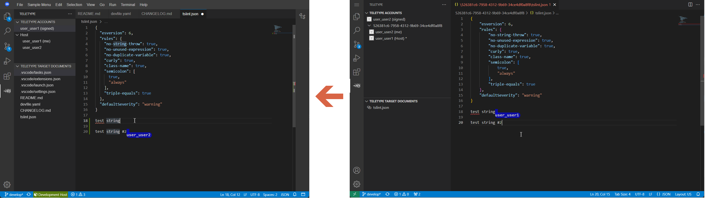


## Synchronization when editing different files

If following is disconnected from the host user or other guest users, it can be a state in which different files are generally displayed on the editor.
If you edit the document in that state, the contents cannot be immediately reflected in the editors of other users. (This is an issue according to Visual Studio Code and Theia's policy.) Therefore, these edits are once in a pending state, and are actually reflected only when the appropriate moment arrives.

First, it is assumed that the host user has multiple files open. In that state, if a guest user arbitrarily selects another editor, the following will be cut off. (The * next to the Host username in the Teletype Accounts view disappears.)

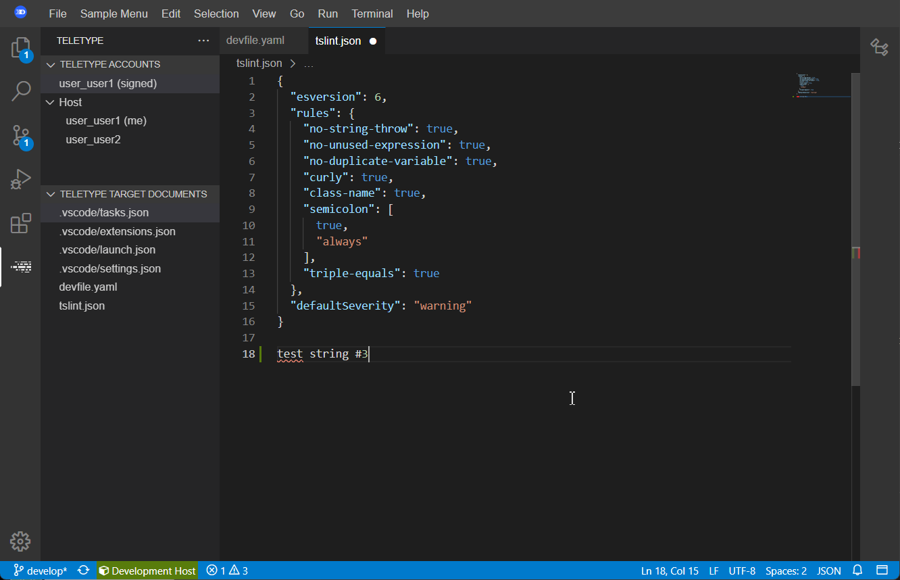

In a situation where following is discontinued and the focus is on different editors, editing is not immediately reflected, but the fact that changes are being made to the document is displayed instead.
Among the files listed in the Teletype Target Documents view, a * character is displayed next to a file that is currently being modified but not synchronized yet.

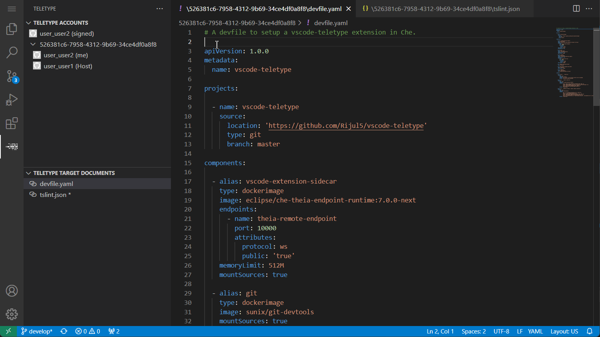

The point at which synchronization actually occurs is the moment when the corresponding editor is activated, and until then, it is in the pending state, which is putting off reflection.

Among the file names displayed in the Teletype Target Documents view, if you activate the corresponding editor by clicking on the item with the * character, the changed content is actually reflected and you can see the changed text content.
When this delayed synchronization is completed, the * character displayed next to the file name of the editor displayed in the Teletype target documents view also disappears.

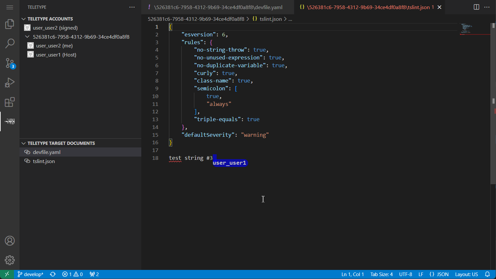


## Close guest connection

If the guest user wants to finish viewing the source, he or she can disconnect from the Portal.

Right-click the Host ID item in the Teletype Accounts view to invoke the pop-up menu.

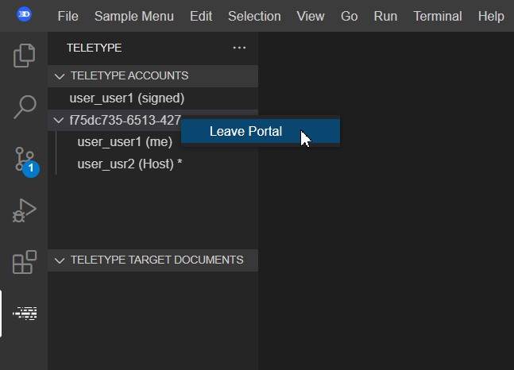

If you click Leave Portal in the pop-up menu, you will end the connection.
When the connection is terminated, the Host ID item disappears from the Teletype Accounts view. Also, among the list of Teletype Target Documents view where the list of shared sources being browsed was displayed, the portal sources disappear.

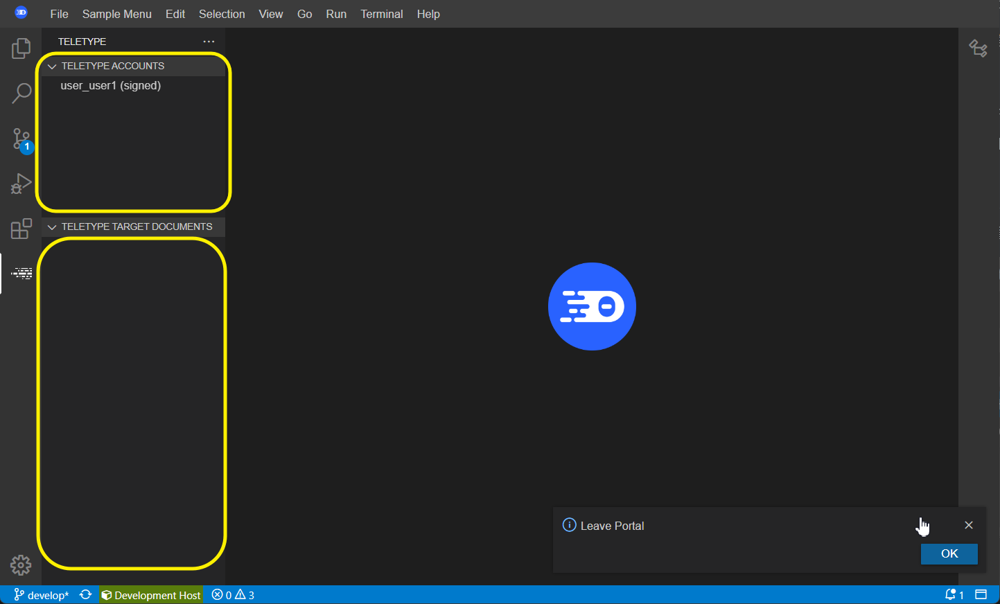


## Close Teletype Host

If the Host user wants to stop sharing the source any more, he can close the Portal.

In the Teletype Accounts view, right-click the Host item to invoke the pop-up menu.


If you click the Close Host Portal item in the pop-up menu, a pop-up message indicating that the connection has been terminated is displayed, and the Host item disappears from the Teletype Accounts view. Also, all items disappear from the list of editors that are currently being shared.


There is one caveat when the host user closes the portal. The point is that if the Guest user exits while the edited content has not yet been reflected, the edited content will be lost.
If there is a Guest user who does not currently follow the Host user, the * character that means following will disappear from the Host user ID in the Guest user's Teletype Accounts view.
In this state, Guest user and Host user can look at different editors. At this time, if Guest edits the contents of the document, * mark appears next to the file name Guest is editing in the Teletype Target Documents view because the changes in the document have not yet been reflected in the host user's document.

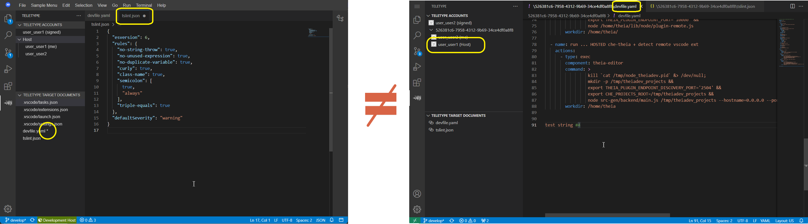

At this time, if the host user wants to stop sharing the workspace and try to close the Portal, he or she can issue the shutdown command through the pop-up menu.

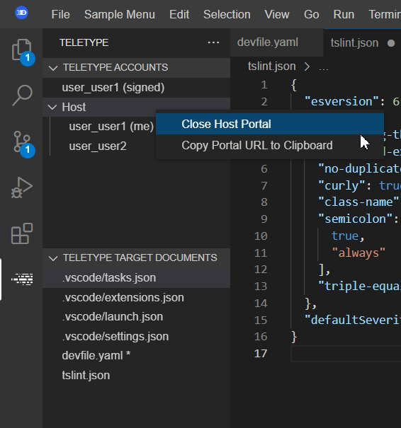

At this time, a termination confirmation pop-up window appears with a warning message that there are unreflected edits.

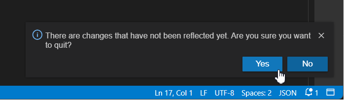

If you click Yes here, Portal will be closed normally, but unreflected edits will be lost instead.
If you want to go through the exit procedure again after checking and applying the unreflected contents, press No. In that case, the pop-up window is closed and the shutdown procedure is canceled.
