# vscode-teletype

**Teletype for VisualStudio Code and Theia and Code-Server**

---

<p align="center">
  <p align="center">
    <a href="README.md">English</a>
    ·
    <a href="README_kr.md">한국어</a>
  </p>
</p>

---

## Eclipse Che에서 Teletype 실행

workspaces 페이지 탭 클릭

workspaces 페이지가 나타난다.

Add Workspace 버튼을 클릭한다

Create Workspace 페이지 나타난다.

Devfile 항목에 텍스트 박스가 나타난다.

Devfile 항목의 텍스트 박스에 다음의 내용을 입력한다.

Create&Open 버튼을 클릭한다.

> data
```yaml
apiVersion: 1.0.0
metadata: 
  name: Teletype-test-1
  projects:
    - name: official-testcase-spring1
      source:     
        location: 'https://code.sdsdev.co.kr/cloud-ide/official-testcase-spring1.git'
        type: github
components:
  - id: sds/Teletype/0.0.1
    type: chePlugin
```

RECENT WORKSPACES 항목에 Teletype-1 항목이 나타난다.
Teletype-1 항목의 색이 녹색으로 변한다.
일정 시간이 경과한 후 우측에 theia 화면이 나타난다.
theia 왼쪽 페이지에 Teletype 항목이 나타난다.

Teletype 탭을 클릭하면 Teletype 페이지로 전환된다.


상단에 Teletype Accounts 뷰 가 나타난다.

하단에 editors 뷰가 나타난다.

Teletype Accounts 뷰에 Signin 버튼이 나타난다.


## Teletype Sign-in

상단의 Teletype Accounts 뷰가 보인다
Teletype Accounts 뷰에 Signin 버튼이 보인다.
Signin 버튼을 누른다.
user id 입력 받는 입력박스가 나타난다.

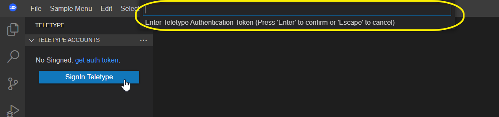


유저 이름을 입력하고 enter를 누른다.

Teletype Accounts 뷰에서 Signin 버튼이 사라지고 트리뷰가 나타난다.

트리뷰의 첫번째 항목에 유저 이름이 나타난다.

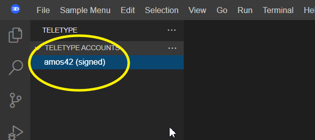


## Teletype Signout

Teletype Accounts 뷰의 user 이름 항목을 우클릭 한다.

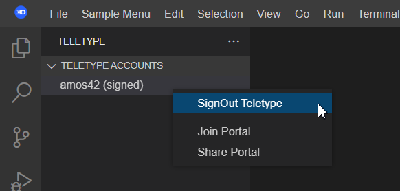

팝업 메뉴가 나타나며 다음 항목들이 보인다.

    Signout Teletype
    shared Portal
    join to Portal

팝업 메뉴 중, Signout Teletype 을 클릭한다.

Teletype Accounts 뷰의 tree에서 계정 항목이 사라진다.

Signin 버튼이 다시 나타난다.

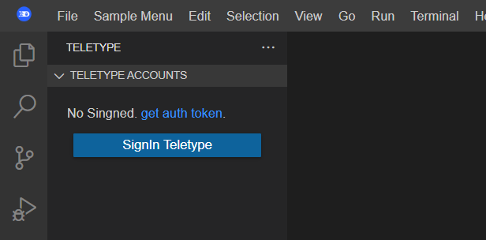


Host
## Teletype Host 생성

Teletype Accounts 뷰에서 user_user1 항목을 우클릭 한다.

팝업 메뉴가 나타나며, 팝업 메뉴 항목은 다음과 같다.

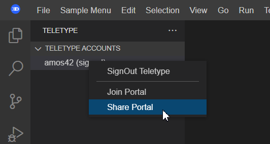

shared Portal를 선택한다.
팝업 메시지로 Create Portal with ID atom://Teletype/Portal/xxxxxxxxxxxx-xxxx-xxxx-xxxx-xxxxxxxxxxxx 메시지가 나타난다.

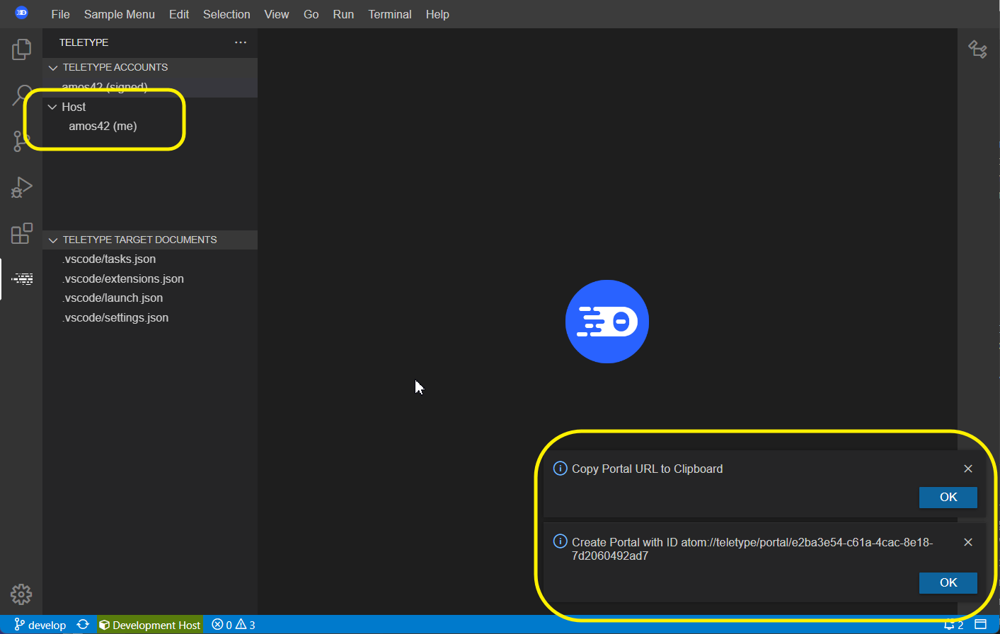

Teletype Accounts 뷰의 트리뷰에 Host 항목이 추가된다.

Host 항목의 하단에 user_user1이 기본으로 추가된다.

팝업 메시지로 Copy Portal to URL to Clipboard가 나타난다.


## Host Portal URL을 클립보드로 복사

Teletype Accounts 뷰에서 Host 항목을 우클릭 한다.

팝업 메뉴가 나타나며, 팝업 메뉴 항목은 다음과 같다.

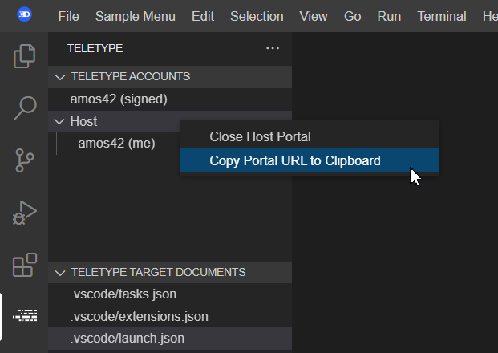

    close Host Portal
    copy Portal url to clipboard

팝업 메뉴 중 copy Portal url to clipboard 항목을 클릭한다.

팝업 메시지로 Copy Portal to URL to Clipboard가 나타난다.

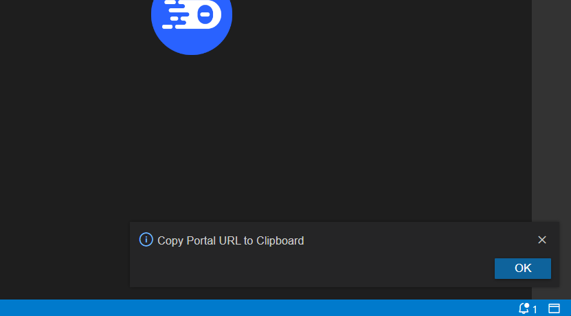


## Teletype Host 닫기

Teletype Accounts 뷰에서 Host 항목을 우클릭 한다.

팝업 메뉴가 나타나며, 팝업 메뉴 항목은 다음과 같다.

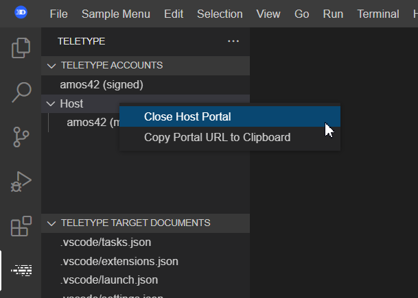

    close Host Portal
    copy Portal url to clipboard

팝업 메뉴 중 close Host Portal 항목을 클릭한다.

팝업 메시지로 Close Host Portal이 나타난다.

Teletype Accounts 뷰의 트리에서 Host 항목이 사라진다.

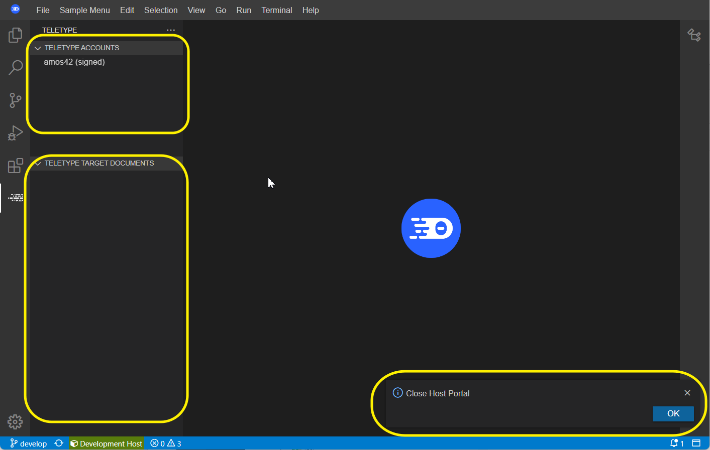


Guest
[Teletype] Teletype Guest 접속

Teletype Accounts 뷰에서 Signin 된 유저 이름 항목을 우클릭 한다.

팝업 메뉴가 나타나며, 팝업 메뉴 항목은 다음과 같다.

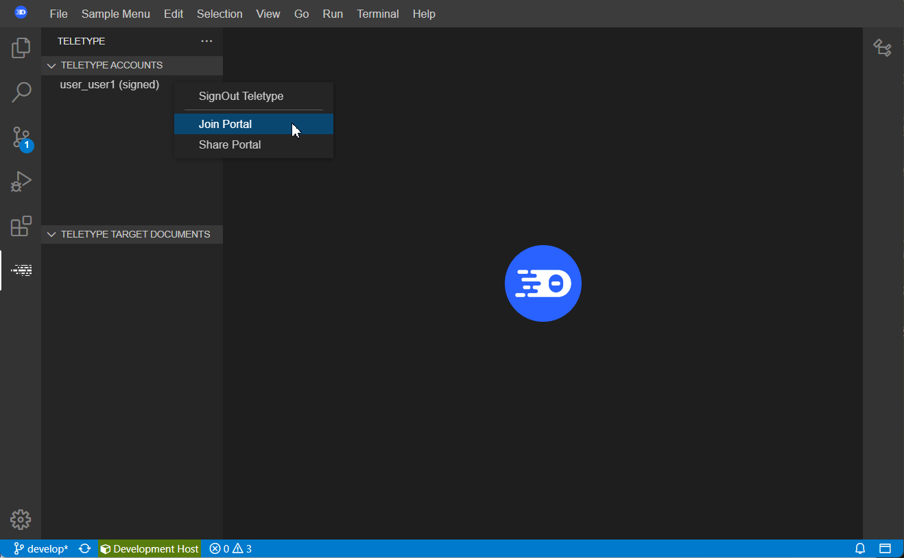

    Signout Teletype
    shared Portal
    join to Portal

join to Portal을 선택한다.

Portal url 입력 창이 나타난다.

클립보드에 저장 된 Host Portal의 url을 붙여넣기 하고 enter를 누른다.

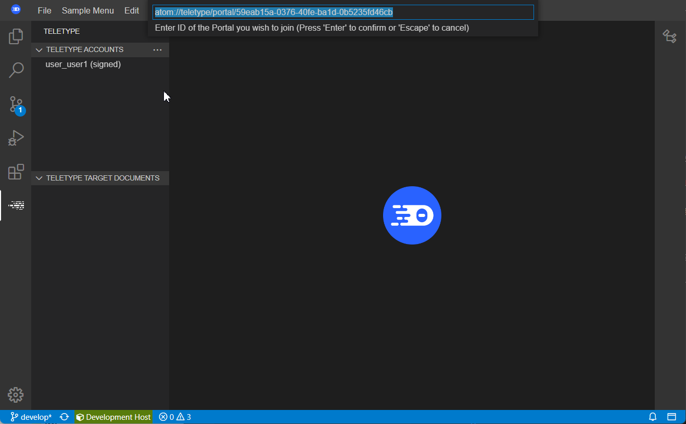


Teletype Accounts 뷰의 트리에 Portal id 항목이 나타난다.

Portal id 항목 아래에 Host 유저의 이름과 현재 Signin 된 유저 이름이 함께 나타난다.

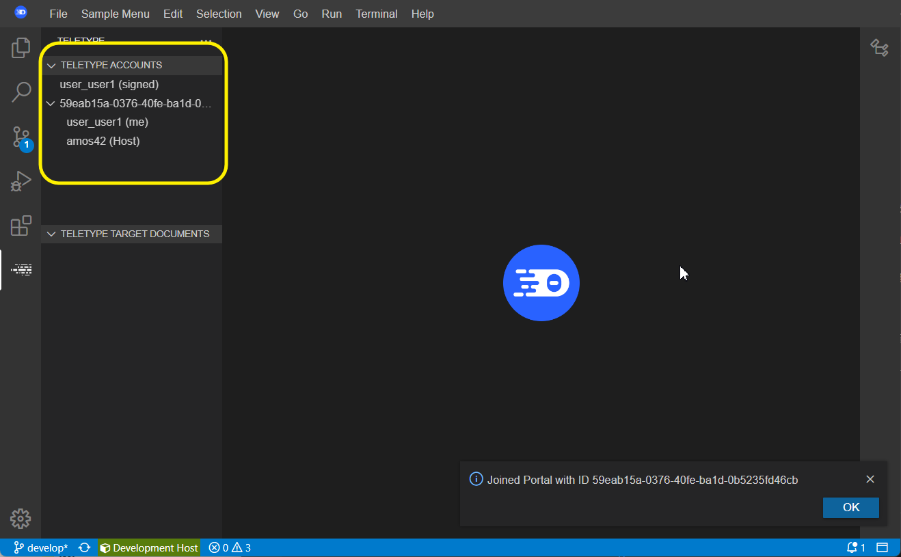


팔로잉


[Teletype] 팔로잉 대상의 에디터 변경 동기화

Teletype Accounts 뷰에서 Host 항목 아래에 Host 유저의 이름과 현재 Guest 자신의 유저 이름이 각각 표시되어 있다.


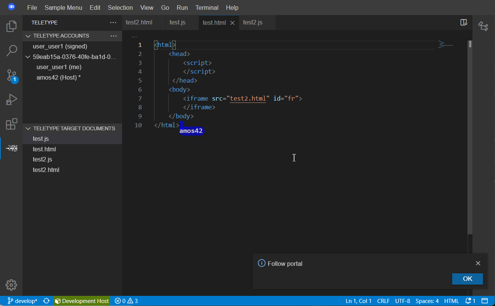


Host 유저 이름의 옆에 ‘*’ 표시가 붙어 있다.

에디터 영역에 2개의 에디터가 열려 있다

현재 열린 에디터는 Host 모드에서 표시 된 에디터와 일치한다.

Host 모드가 포함 된 워크스페이스로 이동한다.

열려 있는 다른 에디터의 탭을 클릭한다.

클릭 한 에디터로 포커스가 이동되어 화면에 표시된다.

Guest 모드가 포함 된 워크스페이스로 이동한다.

Host 모드에서 새로 활성화 한 에디터와 동일한 에디터가 화면에 표시된다.


[Teletype] 팔로잉 끊거나 다시 설정하기


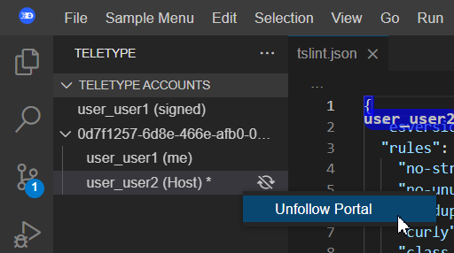


Guest 모드가 포함 된 워크 스페이스로 이동한다.

Teletype Accounts 뷰에서 Host 항목 아래에 Host 유저의 이름과 현재 Guest 자신의 유저 이름이 각각 표시되어 있다.

Host 유저 이름의 옆에 ‘*’ 표시가 붙어 있다.

Host 유저 이름에서 마우스 우클릭을 한다.

팝업 메뉴가 나온다. 메뉴 항목은 다음과 같다.

   Unflollow Portal

팝업 메뉴 중 Unflollow Portal을 클릭한다.

Host 유저 이름의 옆에 ‘*’ 표시가 사라진다.

Host 모드가 포함 된 워크스페이스로 이동한다.

열려 있는 에디터들 중, Guest에서 변경한 에디터와 다른 파일의 탭을 클릭한다.

클릭 한 에디터로 포커스가 이동되어 화면에 표시된다.

Guest 모드가 포함 된 워크스페이스로 이동한다.

Host 모드에서 새로 활성화 한 에디터로 변경이 되지 않고, 이전에 활성화 한 에디터가 여전히 그대로 화면에 표시된다.


[Teletype] Guest에서 에디터 변경시 팔로잉 끊김

Guest 모드가 포함 된 워크 스페이스로 이동한다.

Teletype Accounts 뷰에서 Host 항목 아래에 Host 유저의 이름과 현재 Guest 자신의 유저 이름이 각각 표시되어 있다.

Host 유저 이름의 옆에 ‘*’ 표시가 붙어 있다.

에디터 영역에 3개의 에디터가 열려 있다

현재 열린 에디터는 Host 모드에서 표시 된 에디터와 일치한다.

열려 있는 다른 에디터의 탭을 클릭한다.

클릭 한 에디터로 포커스가 이동되어 화면에 표시된다.

Teletype Accounts 뷰에서 Host 항목 아래에 Host 유저 이름의 옆에 있던 ‘*’ 표시가 사라진다.

Host 모드가 포함 된 워크스페이스로 이동한다.

열려 있는 에디터들 중, Guest에서 변경한 에디터와 다른 파일의 탭을 클릭한다.

클릭 한 에디터로 포커스가 이동되어 화면에 표시된다.

Guest 모드가 포함 된 워크스페이스로 이동한다.

Host 모드에서 새로 활성화 한 에디터로 변경이 되지 않고, 이전에 활성화 한 에디터가 여전히 그대로 화면에 표시된다.


[Teletype] 팔로잉 대상 변경

Guest 모드가 포함 된 워크 스페이스로 이동한다.

Teletype Accounts 뷰에서 Host 항목 아래에 Host 유저의 이름과 현재 Guest 자신의 유저 이름이 각각 표시되어 있다.

Host 유저 이름의 옆에 ‘*’ 표시가 붙어 있다.

Host와 현재 유저 이름 외의 다른 유저 이름 위에서 마우스 우클릭을 한다.

팝업 메뉴가 나온다. 메뉴 항목은 다음과 같다.

   Flollow Portal


팝업 메뉴 중 Flollow Portal을 클릭한다.

해당 유저 이름의 옆에 ‘*’ 표시가 사라진다.

해당 유저의 Guest 모드가 포함 된 워크스페이스로 이동한다.

열려 있는 에디터들 중, 활성화 된 에디터 이외의 에디터의 탭을 선택한다.

클릭 한 에디터로 포커스가 이동되어 화면에 표시된다.

변경 직전의 Guest 모드가 포함 된 워크스페이스로 이동한다.

follow 대상으로 삼은 유저에서 변경 된 에디터가 활성화되어 나타난다.


Host 모드에서 편집 및 동기화
[Teletype] Host 모드에서 에디터 열기

왼쪽 페이지 탭에서 Explorer 탭을 선택한다.

Explorer 탭으로 전환된다.

현재 워크스페이스의 디렉토리 구조와 파일 목록이 나열된다.

임의의 텍스트 파일을 골라 더블클릭한다.

에디트 영역에 해당 텍스트 파일이 열린다.

왼쪽 페이지 탭에서 Teletype 탭을 선택한다.

Teleteype 탭으로 전환된다.

Teletype target documents 뷰에 현재 워크스페이스에서 열린 텍스트 에디터의 목록이 나열된다.

Guest로 join한 다른 web-ide 워크스페이스로 전환한다.

Host에서 연 텍스트 파일과 동일한 내용의 에디터가 열려 있다.

Teletype target documents 뷰에 현재 Host에서 연 텍스트 에디터의 목록이 동일하게 나열된다.


[Teletype] Host 모드에서 에디터의 커서 위치 변경

Host 모드로 연 web-ide 워크스페이스로 이동한다.

Teletype target documents에 열린 에디터를 클릭한다.

해당 에디터가 에디터 모드에 활성화 된다.

문서의 특정 위치로 마우스를 클릭한다.

커서의 위치가 해당 위치로 이동된다.

Guest 모드로 연 web ide의 워크스페이스를 활성화 한다.

Host 모드에서 연 문서에 해당하는 에디터가 에디터 영역에 표시되어 있다.

Host 모드의 에디터에서의 커서 위치에 마크가 되어 있으며, Host 모드의 유저 아이디가 표기되어 있다.

Host 모드로 연 web-ide 워크스페이스로 이동한다.

문서 상의 다른 위치로 마우스를 클릭한다.

커서의 위치가 새로운 위치로 이동된다.

Guest 모드로 연 web ide의 워크스페이스를 활성화 한다.

Host 모드의 에디터에서의 이동한 새로운 커서 위치에 마크가 되어 있으며, Host 모드의 유저 아이디가 표기되어 있다.


[Teletype] Host 모드에서 에디터의 선택 영역 변경

Host 모드의 Teletype이 포함 된 워크스페이스에서 열려 있는 에디터를 선택한다.

마우스로 드래그하여 텍스트 영역의 일부를 선택한다.

마우스로 드래그 한 영역이 블럭으로 선택된다.

Guest 모드의 Teletype이 포함 된 워크스페이스로 이동한다.

Host 모드에서 연 파일과 동일한 파일의 에디터가 열려 있다.

Host 모드에서 선택한 영역과 동일한 영역에 마커가 칠해져 있다.


[Teletype] Host 모드에서 편집

Host 모드의 Teletype이 포함 된 워크스페이스에서 열려 있는 에디터를 선택한다.

에디터의 임의의 위치로 커서를 이동한다.

임의의 텍스트 내용을 입력한다.

Guest 모드의 Teletype이 포함 된 워크스페이스로 이동한다.

Host 모드에서 연 파일과 동일한 파일의 에디터가 열려 있다.

Host 모드에서 추가한 텍스트가 동일하게 입력되어 있다.

새롭게 입력한 텍스트의 마지막 위치에 커서 마커가 표시되며 Host 유저 이름이 표시되어 있다.


Guest 모드에서 편집 및 동기화


[Teletype] Guest 모드에서 에디터의 커서 위치 변경

Guest 모드로 연 web-ide 워크스페이스로 이동한다.

에디터 영역에 텍스트 에디터가 열려 있다.

문서의 특정 위치로 마우스를 클릭한다.

커서의 위치가 해당 위치로 이동된다.

Host 모드로 연 web ide의 워크스페이스를 활성화 한다.

Guest의 에디터에서의 커서 위치에 마크가 되어 있으며, Guest 유저 아이디가 표기되어 있다.

Guest 모드로 연 web-ide 워크스페이스로 이동한다.

문서 상의 다른 위치로 마우스를 클릭한다.

커서의 위치가 새로운 위치로 이동된다.

Host 모드로 연 web ide의 워크스페이스를 활성화 한다.

Guest 에디터에서의 이동한 새로운 커서 위치에 마크가 되어 있으며, Guest의 유저 아이디가 표기되어 있다.


[Teletype] Guest 모드에서 에디터의 선택 영역 변경

teleteype Host 생성 된 상태

다른 워크스페이스의 teleteype에서 Guest 모드로 Host에 join 한 상태

Host 모드의 워크스페이스에서 임의의 텍스트 파일을 선택해 에디터가 열린 상태

Guest 모드의 Teletype이 포함 된 워크스페이스에서 열려 있는 에디터를 선택한다.

마우스로 드래그하여 텍스트 영역의 일부를 선택한다.

마우스로 드래그 한 영역이 블럭으로 선택된다.

Host 모드의 Teletype이 포함 된 워크스페이스로 이동한다.

Guest 모드에서 선택한 영역과 동일한 영역에 마커가 칠해져 있다.

[Teletype] Guest 모드에서 편집

Guest 모드의 Teletype이 포함 된 워크스페이스에서 열려 있는 에디터를 선택한다.

에디터의 임의의 위치로 커서를 이동한다.

임의의 텍스트 내용을 입력한다.

입력한 내용이 에디터에 반영되어 텍스트 내용이 변경된다.

Host 모드의 Teletype이 포함 된 워크스페이스로 이동한다.

Guest 모드에서 추가한 텍스트가 동일하게 입력되어 있다.

새롭게 입력한 텍스트의 마지막 위치에 커서 마커가 표시되며 Host 유저 이름이 표시되어 있다.


[Teletype] 서로 포커싱이 다를 때 편집

Guest 모드의 Teletype이 포함 된 워크스페이스에서 열려 있는 에디터를 선택한다.

Host에서 연 에디터가 나타난다.

에디터 목록 중 현재 활성화 된 것과 다른 에디터 탭을 선택한다.

다른 에디터가 활성화 된다.

Teletype Accounts 뷰의 Host 유저 이름 옆의 ‘*’가 사라진다.

텍스트 에디터에 임의의 문자를 입력한다.

새로 입력한 내용을 반영하여 텍스트 내용이 변경된다.

Host 모드의 Teletype이 포함 된 워크스페이스를 활성화 한다.

Guest 모드와 다른 에디터가 활성화 되어 있다.

Teletype target documents 뷰에 Guest 모드에서 활성화 된 에디터에 해당하는 파일명의 옆에 ‘*’ 문자가 나타난다.

Teletype target documents 뷰에 나타난 파일명 중 ‘*’ 문자가 붙은 항목을 클릭한다.

선택 된 파일명에 해당하는 텍스트 에디터가 활성화 된다.

Guest에서 변경한 내용이 반영되어 텍스트 내용이 변경 된다.

Teletype target documents 뷰에 나타난 해당 에디터의 파일명 옆의 ‘*’ 문자가 사라진다.


접속 종료
[Teletype] Teletype Host Portal 종료

Host 모드로 연 web-ide 워크스페이스로 이동한다.

teleteype Teletype Accounts 뷰에 Host 항목이 보인다.

teleteype Teletype Accounts 뷰의 Host 항목을 마우스 우클릭 한다.

팝업 메뉴가 나타나며, 다음의 항목들이 보인다.

  Close Host Portal
  Copy Host Portal URL to Clipboard

팝업 메뉴에서 Close Host Portal을 클릭한다.

Teletype Accounts 뷰에서 Host 항목이 사라진다.

Close Host Portal 이라는 팝업 메시지가 나타난다.

Guest 모드로 연 web-ide 워크스페이스로 이동한다.

Teletype Accounts 뷰에서 Host의 ID 항목이 사라진다.


[Teletype] Teletype Guest 접속 종료

Guest 모드로 연 web-ide 워크스페이스로 이동한다.

teleteype Teletype Accounts 뷰에 Host의 ID 항목이 보인다.

teleteype Teletype Accounts 뷰의 Host의 ID 항목을 마우스 우클릭 한다.

팝업 메뉴가 나타나며, 다음의 항목들이 보인다.

  Leave Portal

팝업 메뉴에서 Leave Portal을 클릭한다.

Teletype Accounts 뷰에서 Host의 ID 항목이 사라진다.

Leave Portal 이라는 팝업 메시지가 나타난다.

Host 모드로 연 web-ide 워크스페이스로 이동한다.

Teletype Accounts 뷰에서 Host 항목에서 Guest 유저의 이름이 사라진다.


[Teletype] Host 종료시 미반영 편집 내용 경고

Guest 모드의 Teletype이 포함 된 워크스페이스에서 열려 있는 에디터를 선택한다.

Host에서 연 에디터가 나타난다.

에디터 목록 중 현재 활성화 된 것과 다른 에디터 탭을 선택한다.

다른 에디터가 활성화 된다.

Teletype Accounts 뷰의 Host 유저 이름 옆의 ‘*’가 사라진다.

텍스트 에디터에 임의의 문자를 입력한다.

새로 입력한 내용을 반영하여 텍스트 내용이 변경된다.

Host 모드의 Teletype이 포함 된 워크스페이스를 활성화 한다.

Guest 모드와 다른 에디터가 활성화 되어 있다.

Teletype target documents 뷰에 Guest 모드에서 활성화 된 에디터에 해당하는 파일명의 옆에 ‘*’ 문자가 나타난다.

Teletype Accounts 뷰의 Host 항목을 마우스 우클릭 한다.

팝업 메뉴가 나타나며, 다음의 항목들이 보인다.

  Close Host Portal
  Copy Host Portal URL to Clipboard

팝업 메뉴에서 Close Host Portal을 클릭한다.

종료 확인 팝업창이 나타나며 다음의 메시지가 출력된다.

There are changes that have not been reflected yet. Are you sure you want to quit?

팝업창에 Yes와 No 버튼이 표시된다.

No 버튼을 누른다.

팝업창이 닫히고 종료 절차가 취소된다.


